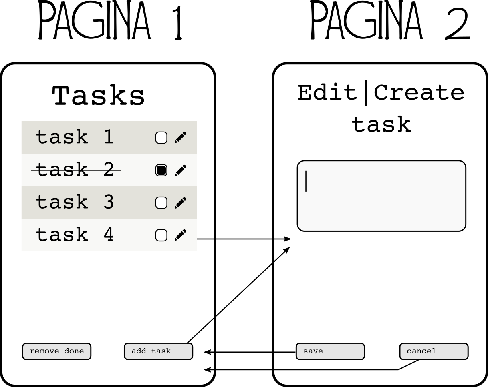

# elm-todo project
Dit project is ontwikkeld als onderdeel van het Frontend Fest, waarbij de opzet is
om dezelfde simpele todo app in twee verschillende 'talen' te ontwikkelen, zodat
we ervaringen kunnen opdoen op basis waarvan we de 'talen' kunnen vergelijken.

Het achterliggende doel is om een meer inhoudelijke discussie te kunnen voeren.


## Elm omgeving op je computer
Voor we aan het project beginnen moet je een werkende Elm omgeving op je computer
hebben. Er is gekozen voor de (Github) editor Atom, omdat die middels een aantal
plugins goede support heeft voor Elm.
Elm is te installeren als `npm` package (node package manager), maar om de een of andere reden valt elm niet met `npm` te installeren. We gebruiken dan ook `yarn`, een alternatieve npm package manager, die het wel goed doet.

1. installeer Node.js. Voor linux: kijk op [deze](https://www.digitalocean.com/community/tutorials/how-to-install-node-js-on-ubuntu-16-04) pagina, en volg "how to install using ppa"
3. installeer yarn. De instructies (voor linux) zijn [hier](https://yarnpkg.com/lang/en/docs/install/) te vinden
3. installeer elm `sudo yarn global add elm`
4. installeer de Atom text editor. [Hier](https://flight-manual.atom.io/getting-started/sections/installing-atom/) zijn de instructies.
5. installeer elm-format `sudo yarn global add elm-format`
6. installeer de volgende atom packages (via: edit -> preferences -> install)
  1. elmjutsu (installeert language-elm transitief). voegt [een hoop](https://atom.io/packages/elmjutsu) language support toe.
  2. elm-format (code formatting bij opslaan)
  3. elm-navigator (een side bar met directe links naar functies)
  4. hidpi (als de Atom interface elementen te klein zijn bij jouw resolutie)


## Overzicht
Zo ziet de app er (straks) uit:
Logo: 

Het hoofdscherm van de app toont een lijst met taken, en het is mogelijk om taken als 'done' te marken. Het is mogelijk om alle taken die als 'done' zijn gemarkeerd in een keer te verwijderen.

Het moet mogelijk zijn om nieuwe taken toe te voegen. Hiervoor
heeft de app een tweede scherm met een formulier. Het tekstveld mag niet leeg zijn wanneer er op 'save' wordt gedrukt. Bij cancel wordt de actie verworpen. Beide knoppen navigeren terug naar het hoofdscherm.

Het moet mogelijk zijn om bestaande taken te bewerken. Ook hier geld dat een leeg tekst veld niet is toegestaan.

Het project is opgebouwd uit verschillende fasen. Iedere fase heeft een duidelijk omschreven doelstelling, en er is voor iedere fase een branch die het resultaat bevat mocht willen cheaten.

Het project is gebaseerd op de twitter bootstrap css. In de `./ext` folder vind je een mockup voor de app.

## De files
`src/elm/Main.elm`
Dit is de source file voor de app

`src/static/styles/main.scss`
Dit is de sass file voor het project

`scr/static/index.html & src/static/index.js`
De basis pagina html en js dependencies. De html voor onze app komt hier niet in maar bouwen we als code in elm.

`ext/`
Voorbeelden en documentatie. Hier vindt je een mockup voor de html en css voor het project.


## bouwen en runnen
Na het uitchecken van de source moet je twee dingen doen om het project te bouwen:

```
npm install
elm package install
```

Als dit gebeurd is, kun je de applicatie starten met

`npm start`

als het goed is heb je de test applicatie nu runnen op
`http://localhost:8080`

## hot code reloading
Omdat in elm applicaties de code en de data (state) van je applicatie strikt zijn gescheiden, is het mogelijk om de code live te herladen zonder dat de state van je applicatie hierdoor wordt beinvloed. Dit is ook wat er gebeurt wanneer je elm of sass code aanpast in dit project. Dit wordt verzorgd door de webpack module `elm-hot-loader`.

Een andere interessante eigenschap van dit model is dat je snapshots kunt maken van de state van je applicatie op een bepaald moment (het zijn allemaal immutable values) en dat je die terug kunt spelen door je applicatie heen. Je applicatie is immers een functie over een bepaalde app state en een bepaalde Message, met als resultaat een nieuwe state, en een nieuwe view (dom). Dit wordt ook door Elm ondersteund. Door 'Explore history' aan te klikken open je de Elm debugger, die een overzicht geeft van iedere fase van je applicatie. Hier kun je zien wat het effect van een bepaalde Message op je applicatie state is, en je kunt de geschiedenis replayen.

Deze twee features zijn dus ook in tandem te gebruiken wat een erg krachtig ontwikkelmodel oplevert.

## Ontwikkelen van de Todo app
We gaan de todo app ontwikkelen in een aantal stappen. Het resultaat van iedere stap is te vinden in een branch, zodat je eventueel kunt spieken als je er niet uitkomt. als je gaat beginnen check je de branch `0-start` uit. Deze branch bevat een werkend elm project gebaseerd op wabpack en met hot reloading geconfigureerd.

### Stap 1: Twee pagina's
In deze stap gaan we twee pagina's ontwikkelen, met navigatie over en weer, en integratie met de browser history api. Dit betekent dat wanneer je naar een pagina navigeert dit de url veranderd, en dat je dus ook naar de pagina's kunt navigeren via de url.
[Hier](https://github.com/elm-lang/navigation) is de informatie over de navigatie api.

het resultaat van deze stap is te vinden in branch `1-paginas`

### Stap 2: pagina 1 - task lijst
Pagina 1 toont een lijst van tasks (test data). Het is mogelijk om en task als 'done' te vinken, en weer op 'todo' te zetten. De knop 'remove done' werkt al. De knop 'add task' en het edit knopje per task doen nog niets.

het resultaat van deze stap is te vinden in branch `2-taken`

### Stap 3: pagina 2 - add task
De 'add task' button werkt nu, en pagina 2 toont het formulier. De titel is 'Add task'. De 'save' en 'cancel' buttons werken. Je kunt deze pagina ook bereiken door '/#new' in de adres balk te typen.

het resultaat van deze stap is te vinden in branch `3-nieuwe-taak`

### Stap 4: pagina 2 - edit task
De edit linkjes werken nu, en als je op die manier op pagina 2 komt is de titel 'Edit task'. De oude waarde wordt in het formulier ingeladen, en de 'save' button past de waarde aan. Beide buttons zorgen dat je naar pagina1 terug navigeert. Je kunt deze pagina ook bereiken door /#edit/[id] in de adres balk te typen.

het resultaat van deze stap is te vinden in branch `4-taak-weizigen`
